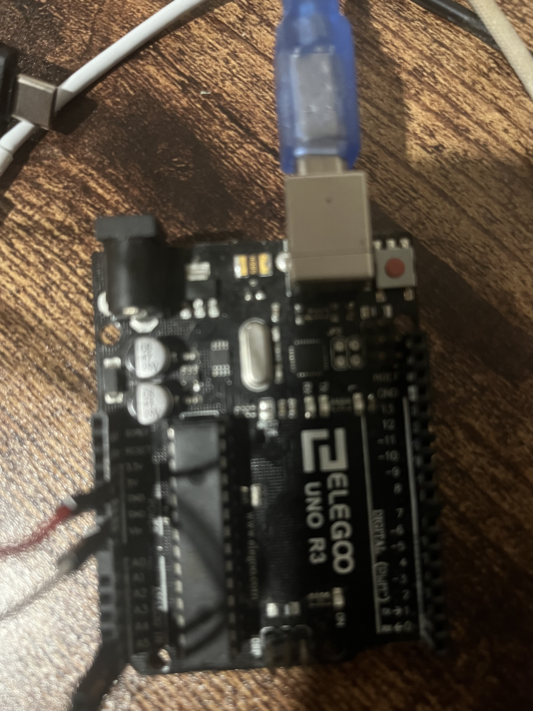
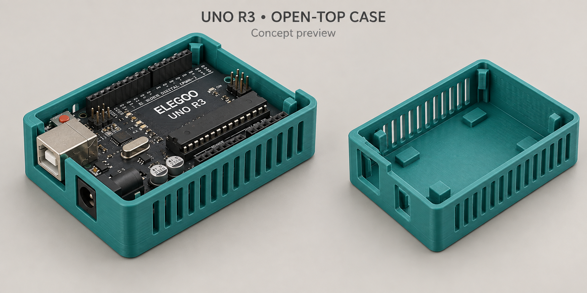
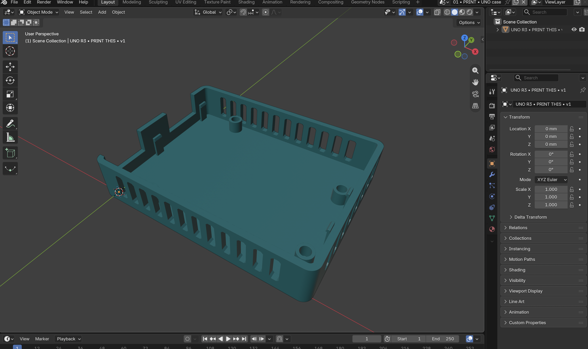
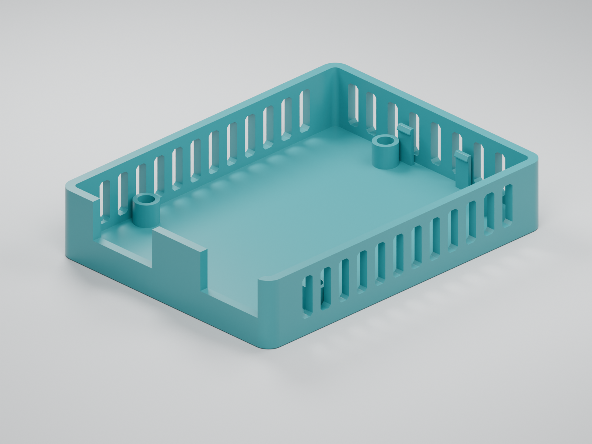
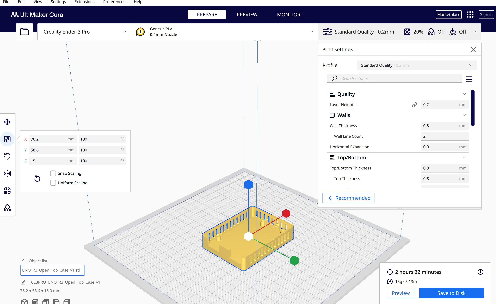
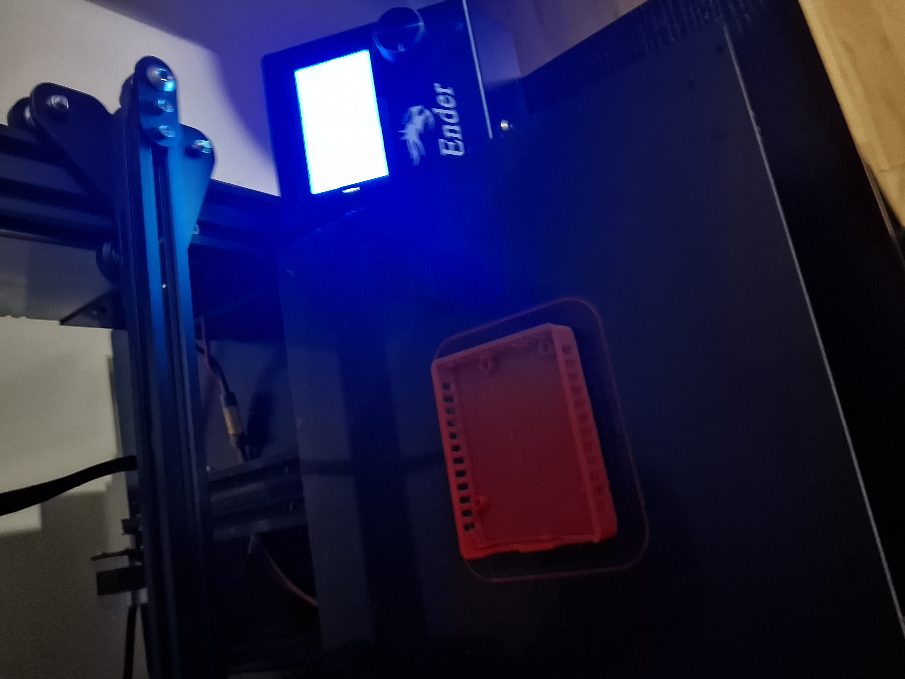

# An Arduino case, from prompt to print

Built with **GPT-6 Astra + Blender**, sliced in **Cura**, and printed on a **Creality Ender 3 Pro**.

**Status · September 19, 2026:** Print complete. Finished case pictured below; board fit check pending.

## 1. Connect Astra to Blender

We used Blender 5.2.0 LTS and the official Blender Lab MCP integration.

1. Install [the MCP add-on](mcp-1.0.3.zip) in Blender and enable it.
2. In **Preferences → System → Network**, enable **Allow Online Access**.
3. In the add-on settings, click **Start MCP Bridge Server** (`localhost:9876`).
4. Connect the [server bundle](blender-1.0.3.mcpb) to Codex, select **GPT-6 Astra**, and restart Codex. Keep Blender running.

<details>
<summary>Server installation and Codex configuration (macOS)</summary>

With Python 3.10+ installed, run from this repository:

```bash
mkdir -p "$HOME/Blender-MCP/server"
unzip -n blender-1.0.3.mcpb -d "$HOME/Blender-MCP/server"
python3 -m venv "$HOME/Blender-MCP/venv"
"$HOME/Blender-MCP/venv/bin/python" -m pip install "$HOME/Blender-MCP/server"
```

Add this to `~/.codex/config.toml`, replacing `YOUR_USERNAME` with your macOS username:

```toml
[mcp_servers.blender]
command = "/Users/YOUR_USERNAME/Blender-MCP/venv/bin/python"
args = ["-m", "blmcp"]

[mcp_servers.blender.env]
BLENDER_PATH = "/Applications/Blender.app/Contents/MacOS/Blender"
```

After restarting Codex, ask: **“List the objects in the current Blender scene.”** Our test connected successfully and exposed 26 tools.

[Blender MCP documentation](https://www.blender.org/lab/mcp-server/) · [Codex MCP configuration](https://developers.openai.com/codex/mcp)

</details>

## 2. Give it the board and the brief

I supplied this photo of my **ELEGOO UNO R3**, along with my printer setup: **Ender 3 Pro, PLA, 0.4 mm nozzle, and Cura**.



The request: **an open-top case with snap clips, USB and power-jack openings, and jail-bar-style ventilation slots.**

We corrected my initial rough measurement of 65 × 51 mm to the agreed Uno footprint of **68.6 × 53.4 mm**. The final case measures **76.2 × 58.6 × 15 mm**, with 2 mm walls and base. PCB thickness was assumed to be 1.6 mm.

## 3. Approve the concept

Astra generated a concept image first. I approved this design before modeling started.



## 4. Build the printable model

Astra created the case in Blender through MCP, including the supports, snap clips, and connector cutouts.



The exported STL passed closed-mesh, dimension, and diagnostic slicing checks.



**Files:** [Printable STL](uno_case.stl) · [Editable Blender model](uno_case_blender_file.blend)

### Time and AI cost

| Scope | Elapsed time | Tokens processed | Estimated cost |
| --- | --- | ---: | ---: |
| Model creation, checks, and export | 22 min 52 sec | 5,079,903 | US$7.05 |
| Full session through model delivery, including setup | 47 min 46 sec | 7,508,220 | US$11.01 |

The full-session row includes the model-build row. Most tokens were cached conversation input. Costs use [Astra's standard API rates](https://developers.openai.com/api/docs/models/gpt-6-astra), excluding image-generation and search fees; they are estimates, not a Codex subscription bill. Later follow-ups are excluded.

## 5. Slice in Cura

I imported the STL at **100% scale**, flat base down, and sliced it for the Ender 3 Pro.



The saved screenshot shows **0.20 mm layers, 20% infill, two wall lines, and supports off**. The exported G-code starts with a **200°C nozzle** and **60°C bed**.

**Cura estimate:** 2 hours 32 minutes · 15 g / 5.13 m PLA.

[Saved G-code for this printer setup](uno_case.gcode)

## 6. The finished print

The case finished printing on the **Ender 3 Pro**. Here it is on the build plate, with the open top, board supports, and vertical ventilation slots.




**Next:** fit the unplugged UNO R3 and check the snap clips and both cable openings. A photo with the board installed can be added here after the fit check.
